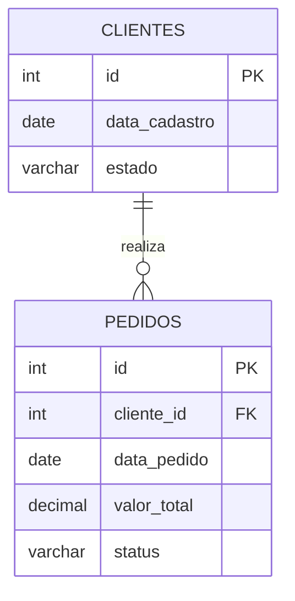

# E-commerce-Analytics

> Projeto de nível intermediário em SQL focado em Engenharia e Análise de Dados para o setor de e-commerce, explorando o comportamento do consumidor, retenção e recorrência de compras.

---

## 1. Visão Geral do Projeto
O objetivo deste repositório é demonstrar habilidades avançadas em manipulação de dados utilizando **SQL**. Através de consultas estruturadas com **CTEs (Common Table Expressions)** e **Window Functions**, o projeto analisa o ciclo de vida do cliente a partir da sua primeira transação, medindo intervalos de recompra e taxas de retenção (*Cohort Retention*).

---

## 2. Arquitetura e Modelagem de Dados
O banco de dados é composto por duas tabelas principais: `clientes` e `pedidos`. 



---

## 3. Estrutura do repositório
schema.sql: Script DDL para a criação das tabelas e população com dados simulados.intervalo_compras.sql: Consulta avançada utilizando ROW_NUMBER() e LEAD() para calcular o tempo médio entre a 1ª e a 2ª compra.analise_cohort.sql: Script analítico para construção da matriz de retenção por coortes mensais ($M+0$ a $M+3$).

---

## 4. Principais Consultas & Lógica de Negócio
A. Tempo Médio entre a 1ª e a 2ª Compra
Esta consulta isola a primeira compra de cada cliente e utiliza a função de janela LEAD() para capturar a data da transação subsequente, permitindo calcular o intervalo exato em dias até a ativação da recorrência.

```
WITH pedidos_ordenados AS (
    SELECT 
        cliente_id,
        data_pedido,
        ROW_NUMBER() OVER (PARTITION BY cliente_id ORDER BY data_pedido ASC) AS ordem_compra,
        LEAD(data_pedido) OVER (PARTITION BY cliente_id ORDER BY data_pedido ASC) AS proxima_data_pedido
    FROM pedidos
    WHERE status = 'Entregue'
),
primeira_e_segunda_compra AS (
    SELECT 
        cliente_id,
        data_pedido AS primeira_compra,
        proxima_data_pedido AS segunda_compra,
        (proxima_data_pedido - data_pedido) AS dias_entre_compras
    FROM pedidos_ordenados
    WHERE ordem_compra = 1 AND proxima_data_pedido IS NOT NULL
)
SELECT 
    COUNT(DISTINCT cliente_id) AS total_clientes_com_recompra,
    ROUND(AVG(dias_entre_compras), 2) AS media_dias_primeira_para_segunda_compra
FROM primeira_e_segunda_compra;

```

B. Análise de Retenção por Cohort (M+0 a M+3)
Agrupa os clientes pelo mês de cadastro original e calcula a proporção de clientes ativos nos meses seguintes, permitindo identificar padrões de sazonalidade e eficácia de campanhas de reengajamento.

--- 

## 5. Business Insights (Exemplo Prático)
Janela Crítica de Recompra: Identificou-se que a maioria dos clientes que retornam para uma segunda compra o fazem dentro de um intervalo de 30 a 45 dias após o cadastro.

Queda de Retenção (M+1): O declínio acentuado nas safras de janeiro sugere a necessidade de implementar fluxos automatizados de e-mail marketing e campanhas de onboarding nas primeiras semanas após o primeiro pedido.

---

## Como Executar
Clone este repositório ou copie os scripts SQL.

Execute o script schema.sql em seu ambiente de banco de dados compatível (PostgreSQL, Google BigQuery, Snowflake, etc.).

Execute as consultas analíticas para visualizar as métricas de comportamento.
