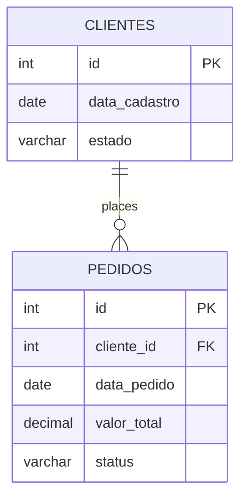

# E-commerce-Analytics

> An intermediate-level SQL project focused on Data Engineering and Analytics for the e-commerce sector, exploring consumer behavior, retention, and repeat purchase patterns.

---

## 1. Project Overview
The goal of this repository is to demonstrate advanced data manipulation skills using **SQL**. Through structured queries utilizing **CTEs (Common Table Expressions)** and **Window Functions**, the project analyzes the customer lifecycle starting from the initial transaction, measuring repurchase intervals and retention rates (*Cohort Retention*).

---

## 2. Data Architecture and Modeling
The database consists of two main tables: `clientes` (customers) and `pedidos` (orders).



---

## 3. Repository Structure
schema.sql: DDL script for creating tables and populating them with simulated data. intervalo_compras.sql: Advanced query using ROW_NUMBER() and LEAD() to calculate the average time between the 1st and 2nd purchase. analise_cohort.sql: Analytical script for constructing a retention matrix based on monthly cohorts ($M+0$ to $M+3$).

---

## 4. Key Queries & Business Logic
A. Average Time Between 1st and 2nd Purchase
This query isolates each customer's first purchase and uses the LEAD() window function to capture the date of the subsequent transaction, allowing for the calculation of the exact interval in days until repeat purchasing begins.

```
WITH ordered_orders AS (
SELECT
cliente_id,
data_pedido,
ROW_NUMBER() OVER (PARTITION BY cliente_id ORDER BY data_pedido ASC) AS purchase_order,
LEAD(data_pedido) OVER (PARTITION BY cliente_id ORDER BY data_pedido ASC) AS next_order_date
FROM pedidos
WHERE status = 'Entregue'
),
first_and_second_purchase AS (
SELECT
cliente_id,
data_pedido AS first_purchase,
next_order_date AS second_purchase,
(next_order_date - data_pedido) AS days_between_purchases
FROM ordered_orders
WHERE purchase_order = 1 AND next_order_date IS NOT NULL
)
SELECT
COUNT(DISTINCT cliente_id) AS total_customers_with_repeat_purchase,
ROUND(AVG(dias_entre_compras), 2) AS avg_days_first_to_second_purchase
FROM first_and_second_purchase;

```

B. Cohort Retention Analysis (M+0 to M+3)
Groups customers by their original registration month and calculates the proportion of active customers in subsequent months, allowing for the identification of seasonality patterns and the effectiveness of re-engagement campaigns.

---

## 5. Business Insights (Practical Example)
Critical Repurchase Window: It was identified that the majority of customers who return for a second purchase do so within a 30-to-45-day interval after registration.

Retention Drop (M+1): The sharp decline observed in January cohorts suggests a need to implement automated email marketing workflows and onboarding campaigns during the first few weeks following the initial order. ---

## How to Run
Clone this repository or copy the SQL scripts.

Execute the `schema.sql` script in your compatible database environment (PostgreSQL, Google BigQuery, Snowflake, etc.).

Run the analytical queries to view the behavioral metrics.
